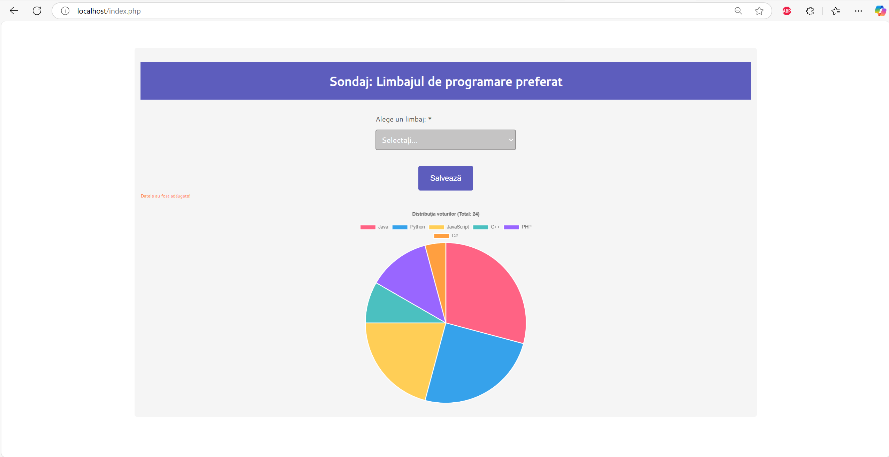
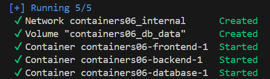

# Lucrarea de laborator nr. 7: Crearea unei aplicații multi-container
# Covrig Andrei, grupa I2301
# 2025

## Scopul lucrării

Familiarizarea cu gestiunea aplicației multi-container creată cu `docker-compose`.

## Sarcina
Crearea unei aplicații php pe baza a trei containere: nginx, php-fpm, mariadb, folosind `docker-compose`.

## Etapele realizării lucrării
## Pregătire

Pentru a efectua această lucrare, am instalat pe computer [Docker](https://www.docker.com/).

## Execuție

Am creat un repozitoriu `containers06` și l-am copiat pe computer.

### Site-ul pe php

În directorul `containers06` am creat directorul `mounts/site`. În acest director, am rescris site-ul php, creat în cadrul disciplinei php.

### Fișiere de configurare

Am creat fișierul `.gitignore` în rădăcina proiectului și am adăugat următoarele linii:

```gitignore
# Ignore files and directories
mounts/site/*
```

Am creat în directorul `containers06` fișierul `nginx/default.conf` cu următorul conținut:

```nginx
server {
    listen 80;
    server_name _;
    root /var/www/html;
    index index.php;
    location / {
        try_files $uri $uri/ /index.php?$args;
    }
    location ~ \.php$ {
        fastcgi_pass backend:9000;
        fastcgi_index index.php;
        fastcgi_param SCRIPT_FILENAME $document_root$fastcgi_script_name;
        include fastcgi_params;
    }
}
```

Am creat în directorul `containers06` fișierul `docker-compose.yml` cu următorul conținut:

```yaml
version: '3.9'

services:
  frontend:
    image: nginx:1.19
    volumes:
      - ./mounts/site:/var/www/html
      - ./nginx/default.conf:/etc/nginx/conf.d/default.conf
    ports:
      - "80:80"
    networks:
      - internal
  backend:
    image: php:7.4-fpm
    volumes:
      - ./mounts/site:/var/www/html
    networks:
      - internal
    env_file:
      - mysql.env
  database:
    image: mysql:8.0
    env_file:
      - mysql.env
    networks:
      - internal
    volumes:
      - db_data:/var/lib/mysql

networks:
  internal: {}

volumes:
  db_data: {}
```

Am creat fișierul `mysql.env` în rădăcina proiectului și am adăugat în el următoarele linii:

```env
MYSQL_ROOT_PASSWORD=secret
MYSQL_DATABASE=app
MYSQL_USER=user
MYSQL_PASSWORD=secret
```

## Pornire și testare

Am pornit containerele cu comanda:

```bash
docker-compose up -d
```

Am verificat funcționarea site-ului în browser, trecând la adresa `http://localhost`. 


## Pregătirea raportului

Am creat în directorul `containers06` fișierul `README.md` care conține descrierea pas cu pas a proiectului. 

## Răspundeți la întrebările:

1. În ce ordine sunt pornite containerele?

Docker Compose pornește containerele în ordinea în care sunt definite în fișierul `docker-compose.yml` (de sus în jos): `frontend`, `backend`, `database`.


2. Unde sunt stocate datele bazei de date?

Datele bazei de date sunt stocate în volumul Docker `db_data`.

3. Cum se numesc containerele proiectului?

Containerele proiectului se numesc `containers06-frontend-1`, `containers06-backend-1`, `containers06-database-1`.

4. Trebuie să adăugați încă un fișier `app.env` cu variabila de mediu `APP_VERSION` pentru serviciile `backend` și `frontend`. Cum se face acest lucru?

Pentru a adăuga fișierul `app.env` și a-l utiliza pentru serviciile backend și frontend, creăm fișierul `app.env` în rădăcina proiectului `containers06` cu următorul conținut:

```
APP_VERSION=1.0.0
```

Ulterior modificăm `docker-compose.yml` pentru a include `env_file: - app.env` în serviciile frontend și backend. Repornim containerele cu `docker-compose down` și `docker-compose up -d`.

## Concluzii
Lucrarea de laborator a oferit o înțelegere practică a gestionării aplicațiilor multi-container cu Docker Compose. Prin crearea unei aplicații PHP folosind nginx, php-fpm și MariaDB, am învățat să configurez containere, să definesc rețele și volume în `docker-compose.yml`. Testarea site-ului a validat integrarea corectă a componentelor de `backend`, `frontend` și `database`.

## Bibliografie
1. [Documentația Docker, docker.com](https://docs.docker.com/get-started/)  
2. [Documentația Nginx, nginx.org](https://nginx.org/en/docs/beginners_guide.html)  
3. [Documentația PHP, php.net](https://www.php.net/manual/en/install.fpm.php) 
4. [Documentația Docker Compose, docs.docker.com](https://docs.docker.com/compose/) 